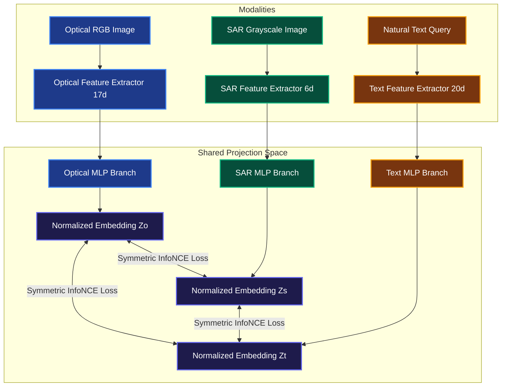

# Cross-Modal Satellite Image Retrieval Using Multi-Sensor Remote Sensing Data

This repository contains a prototype application for cross-modal remote sensing satellite image retrieval. The system aligns three completely distinct sensor and description modalities:
1. **Optical Bands (Passive Reflected Solar Energy)**: RGB color imagery showing visual boundaries, crop colors, and building patterns.
2. **Synthetic Aperture Radar (SAR) (Active Emitted Microwave Backscatter)**: Specular reflection off calm water (very dark returns), double-bounce reflections off vertical concrete structures (extremely bright corners), and volume scattering off forest foliage. Includes Gamma speckle noise simulation.
3. **Natural Language Text Descriptions**: Free-form textual descriptions characterizing the landscape features and presence of elements (e.g. roads, rivers).

To ensure 100% reliability, zero-setup speed, and zero binary size problems on CPU, the core projection networks, feature extractors, and backpropagation optimization loops are written in **pure NumPy and scikit-learn**, with an interactive web UI built in **Streamlit**.

---

## Technical Architecture



### Contrastive Learning & Backpropagation Equations

Each branch projects normalized feature vectors to the shared embedding space:
$$h = \max(0, X W_1 + b_1)$$
$$u = h W_2 + b_2$$
$$z = \frac{u}{\|u\|_2}$$

For a batch of size $B$ and temperature $\tau$, the symmetric InfoNCE loss between modality $A$ and modality $B$ is:
$$S_{AB} = z_A z_B^T \in \mathbb{R}^{B \times B}$$
$$P_{row}[i, j] = \frac{\exp(S_{AB}[i, j]/\tau)}{\sum_k \exp(S_{AB}[i, k]/\tau)}, \quad P_{col}[i, j] = \frac{\exp(S_{AB}[i, j]/\tau)}{\sum_k \exp(S_{AB}[k, j]/\tau)}$$
$$L_{AB} = -\frac{1}{2B} \sum_{i=1}^B \left( \log P_{row}[i, i] + \log P_{col}[i, i] \right)$$

The total loss minimized is:
$$L_{total} = L_{OS} + L_{OT} + L_{ST}$$

The analytical gradient of the pairwise loss with respect to the similarity matrix $S_{AB}$ is:
$$\frac{\partial L_{AB}}{\partial S_{AB}} = \frac{1}{2B\tau} (P_{row} + P_{col} - 2I)$$

Backpropagating the gradient to the unnormalized branch output $u$ (accounting for the L2 normalization quotient rule):
$$\frac{\partial L}{\partial u} = \frac{1}{\|u\|_2} \left( \frac{\partial L}{\partial z} - \left( z \odot \frac{\partial L}{\partial z} \right) z \right)$$

Weights are optimized interactively using the **Adam Optimizer**. Gradient checks are implemented in `test_alignment.py` using finite differences, passing with a relative error of $1.12 \times 10^{-7}$.

---

## How to Install and Run

1. **Install requirements**:
   Make sure you have Python 3.10+ installed. Install the dependencies using pip:
   ```bash
   pip install -r requirements.txt
   ```

2. **Verify mathematical correctness (Optional)**:
   Run the gradient checker and training loop test suite:
   ```bash
   python test_alignment.py
   ```

3. **Launch the interactive Streamlit UI**:
   Start the local web application:
   ```bash
   streamlit run app.py
   ```
   The application will automatically open in your default browser at `http://localhost:8501`.

---

## Application Features

- **Dataset Explorer**: Visually inspect matching Optical/SAR patches and text descriptors representing cities, woodlands, rivers, crop fields, and deserts.
- **Interactive Model Training**: Train the custom neural aligner in real-time. View live training loss curves and check metrics like mAP (Mean Average Precision) and Recall@1/5.
- **Shared Latent Space Projection**: View 2D PCA plots of the joint embedding coordinates. Watch as the different sensors group together by semantic category once alignment is trained.
- **Cross-Modal Retrieval Search Engine**:
  - Search satellite images using natural language text prompts (e.g. searching for "water canal in city").
  - Search SAR radar patches corresponding to optical visual images.
  - Search optical visual patches corresponding to SAR radar readings.
